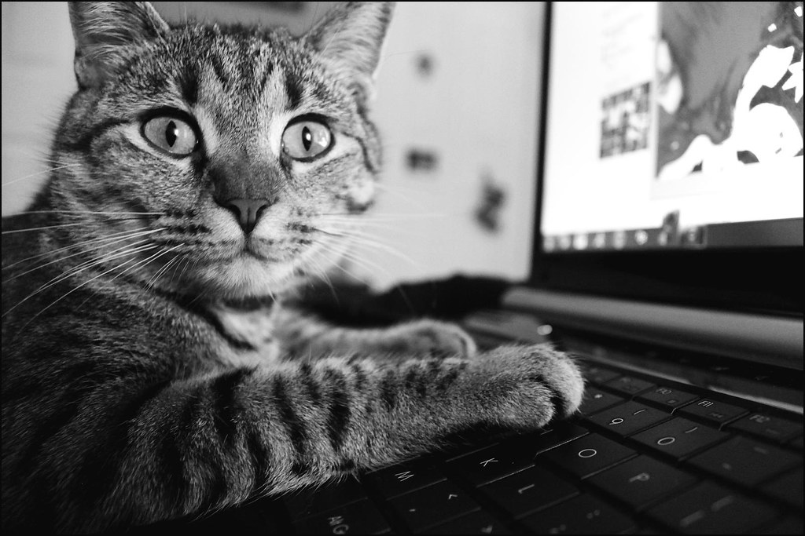

---
#
# By default, content added below the "---" mark will appear in the home page
# between the top bar and the list of recent posts.
# To change the home page layout, edit the _layouts/home.html file.
# See: https://jekyllrb.com/docs/themes/#overriding-theme-defaults
#
layout: home
title: DeriniJyang
description: 데리니쟝의 블로그
---

 

이미지 출처: <https://www.flickr.com/photos/threecheersformcr_xo/5340309206>
